# Single-View-to-3D

Exploring loss functions and decoders for regressing to voxels, point clouds, and mesh representation from single view RGB input.

## Setup

Download and extract the datasets.

* [here](https://huggingface.co/datasets/learning3dvision/r2n2_shapenet_dataset) for a single-class dataset which contains one class of chair. Total size 7.3G after unzipping.

Download the dataset using the following commands:

```
$ sudo apt install git-lfs
$ git lfs install
$ git clone https://huggingface.co/datasets/learning3dvision/r2n2_shapenet_dataset
```

* [here](https://huggingface.co/datasets/learning3dvision/r2n2_shapenet_dataset_full) for an extended version which contains three classes, chair, plane, and car.  Total size 48G after unzipping. Download this dataset with the following command:

```
$ git lfs install
$ git clone https://huggingface.co/datasets/learning3dvision/r2n2_shapenet_dataset_full
```

Downloading the datasets may take a few minutes. After unzipping, set the appropriate path references in `dataset_location.py` file [here](dataset_location.py).

The extended version is required for 3.3; for other parts, using single-class version is sufficient.

Make sure you have installed the packages mentioned in `requirements.txt`.

---

## 1. Exploring loss functions

Defining loss functions, for fitting voxels, point clouds and meshes.\

### Running Code

```
python fit_data.py --type 'mesh|vox|mesh'
```

> *Gifs will be saved at: 'results/'*

### 1.1. Fitting a voxel grid

Used `binary_cross_entropy_with_logits(voxel_src,voxel_tgt)` since voxel is a grid (HxWxC) for 0/1's so BCE will work.

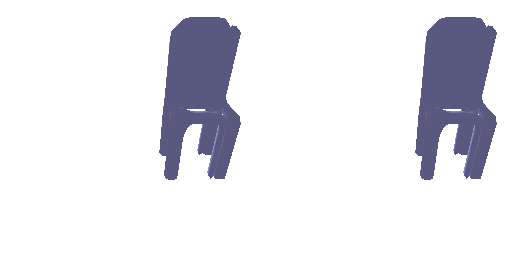

Left is ground-truth, while right is fitted voxel

### 1.2. Fitting a point cloud

Used `chamfer_loss` since point-clouds are unordered sets and purmutation invariant. Chamfer handles set-to-set comparison by calculating mean of nearset-dist b/w src ->tgt & tgt->src.

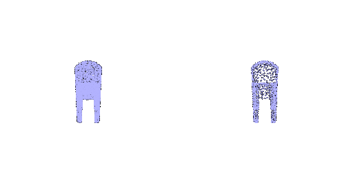

Left is ground-truth, while right is fitted point-cloud

### 1.3. Fitting a mesh

`chamfer_loss` + `smoothness_loss`(Laplacian)

> Chamfer pulls mesh toward target shape. Laplacian prevents ugly deformation.


Left is ground-truth, while right is fitted mesh

---

## 2. Reconstructing 3D from single view

### Train Model

```
python -m main --mode "train" --type 'vox|mesh|point'
```

or

```
python train_model.py --type 'vox' 
```

### 2.1. Image to voxel grid

**Pipeline**

> Img -> Encoder -> 512feats -> upscale(2048) ->Conv3dTanspose layers -> vox-grid
>
> Decoder -> similar to Pix2Vox


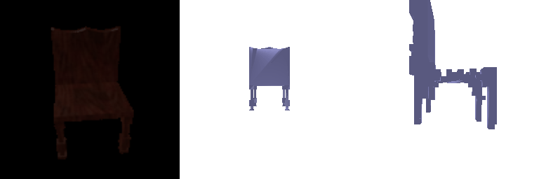

From left to right: RGB image, ground-truth rendered mesh, predicted rendered mesh

## 2.2. Image to point cloud

> Decoder -> Pure MLPs reshaped to num_pts, 3
>
> PSGN:PointSet Generation Network

***Cons: no surface connectivity, hard to enforce smoothness; capture fine details.***

**Pro's: fast -> O(N)**

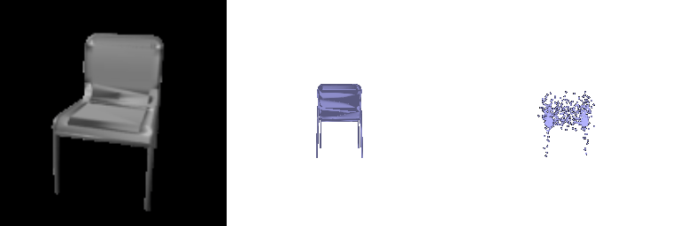

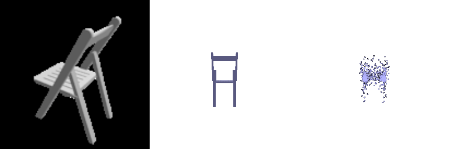

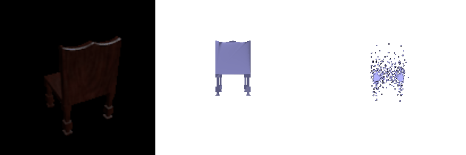

From left to right: RGB image, ground-truth rendered mesh, predicted rendered pointcloud

## 2.3. Image to mesh

> Decoder(Pixel2Mesh, AtlasNet type):
>
> 1. Start from template mesh (ico-sphere: evenly distributed sphere.
> 2. Predict vertex offsets = MLP(img_feats)

***Pros: surface connectivity, differential rendering possible(can use photometric loss)***

***Cons: can't create holes, spilt parts since topology is fixed***


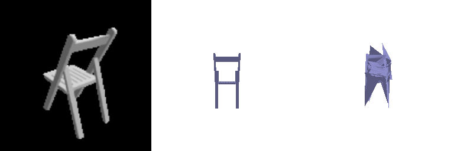

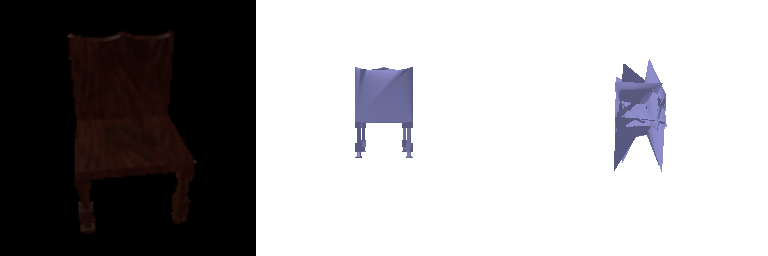

From left to right: RGB image, ground-truth rendered mesh, predicted rendered mesh

---

## 2.4. Quantitative comparisions (F1 Score)

#### Evaluate Model

```
python -m main --mode "eval" --type 'vox|mesh|point' --load_checkpoint
```

or

```
python eval_model.py --type point|mesh|point --load_checkpoint
```

> *Gifs will be saved at: 'results/arg.type/'*

To look at another interpretation(2.6)

```
python eval_model.py --type point  --interpret --load_checkpoint
```

| F1 Vox                                                                                                                                             | F1 PC                                                                                                                                                | F1 Mesh                                                                                                                                             |
| -------------------------------------------------------------------------------------------------------------------------------------------------- | ---------------------------------------------------------------------------------------------------------------------------------------------------- | --------------------------------------------------------------------------------------------------------------------------------------------------- |
|  |  |  |
| Final avg score: 51.1                                                                                                                              | Final avg score: 75.65                                                                                                                               | Final avg score: 72.2                                                                                                                               |

***F1: Gives how much surface is predicted correctly (using precision, recall)***

**Intuition:**

* **Point Clouds:** They are a sparse representation of 3D geometry, capturing key surface points without needing to fill an entire volume. Because they focus on essential geometric features, they’re easier to align with ground truth, leading to a highest F1 score.
* **Meshes:** These represent surfaces with vertices and faces, providing more structure than point clouds but still focusing on the object's boundary. While more detailed, they can introduce errors in surface connectivity or topology, thus the F1 score is lower than point-cloud.
* **Voxels:** Voxel grids discretize 3D space into small cubes, requiring dense, volumetric predictions. This introduces ambiguity and high false positives/negatives, especially with limited input views, leading to the lowest the F1 score.


---


## 2.5. Analyse effects of hyperparams variations

I varied the *'n_points'* hyperparameter and analysed the the effects

| n_points | F1 Score | F1 plot                                  | Gif@300 Image                           |
| -------- | -------- | ---------------------------------------- | --------------------------------------- |
| 512      | 70.65    |   |   |
| 1000     | 75.66    | 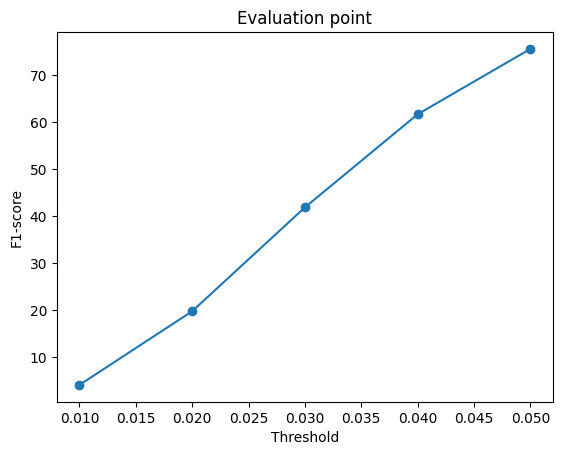             | 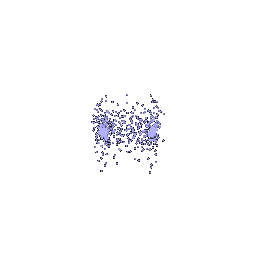 |
| 2048     | 80.83    | 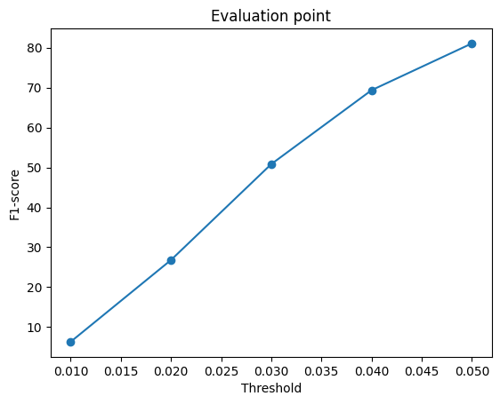 |  |

**Analysis:** As the number of points increases, the average F1 score improves because more samples help the model converge closer to the optimal result. However, this also increases GPU memory usage. The 1000-point model offers a balanced tradeoff between achieving a high F1 score and managing memory consumption.

---


## 3 Extended dataset for training

I trained the point-cloud decoder on the extended r2n2_shapenet_dataset model

##### **Visualizations**


As shown in the third example, for the same chair class, the predicted point cloud appears more geometrically aligned with the original mesh. This suggests that the model learns the characteristics of a chair more effectively, likely due to the increased diversity in the training data.

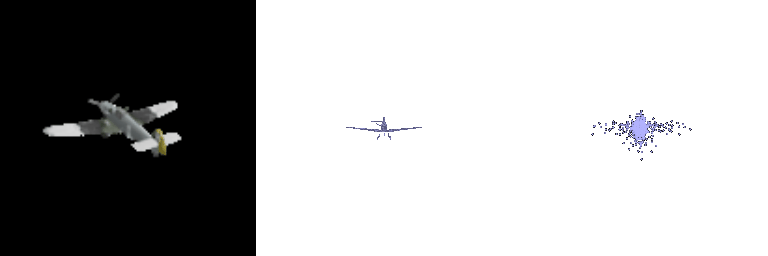

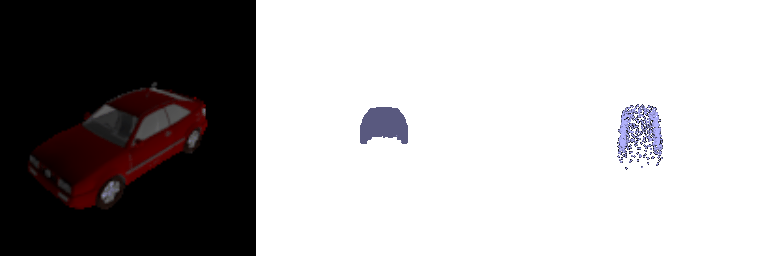

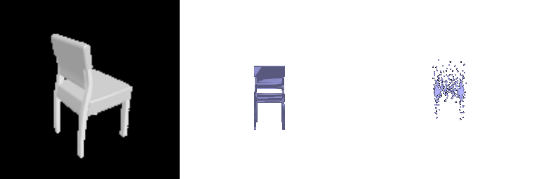

From left to right: original Image, original Mesh, predicted point cloud


**Failure Example:** The predicted mesh does not align with the original mesh. This discrepancy may stem from a lack of similar example images in the dataset, or it could indicate the need for a more complex model to better capture intricate geometric features.

##### Model comparison  "training on one class" VS "training on three classes"

| Training Set  | F1 Score | F1 plot                                     |
| ------------- | -------- | ------------------------------------------- |
| One class     | 75.66    |                 |
| Three classes | 85.73    |  |

The average F1 score significantly increases to 85.73, indicating that the model learns more effectively about the object's general shape, resulting in a better fit. Greater class diversity enhances the model's ability to understand and represent each object more accurately.
